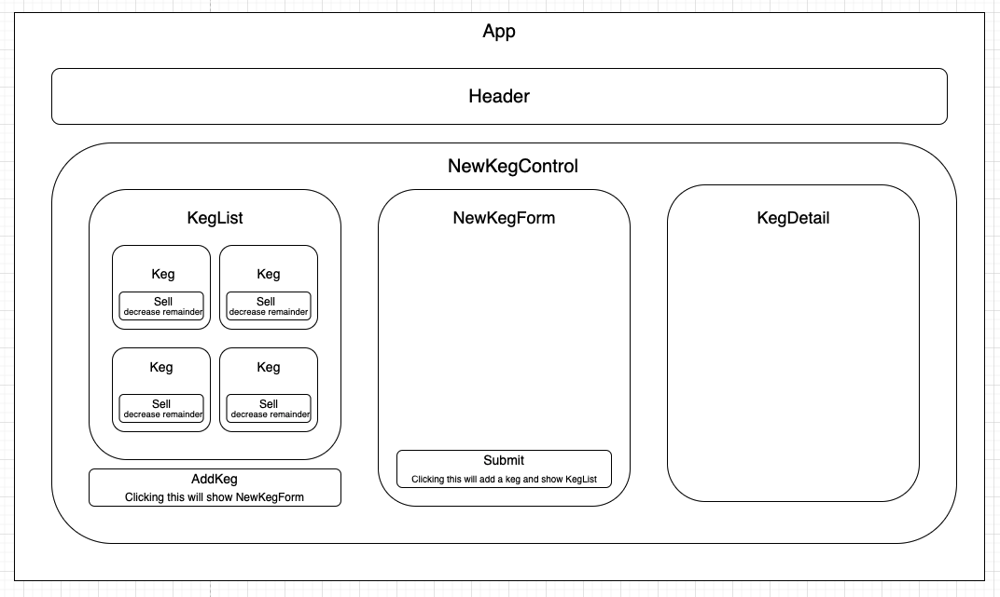

# _Tap Room_

### By _**Jo Miller**_

#### _This project was created solely for the education of the author(s) and is not in a complete or portfolio-ready state. It should not be considered representative of professional work._

[Epicodus](https://www.epicodus.com/) - [React](https://www.learnhowtoprogram.com/ruby-and-rails/) - [Week 2](https://www.learnhowtoprogram.com/react/react-fundamentals/react-fundamentals-independent-project)

#### Date created: 04/23/2021
---

## Technologies Used

* _React 3.2.0_
* _JavaScript_
* _Bootstrap_
* _MDBReact_
* _Webpack 4.41.0_
* _git 2.30.0_

---

## Description

A tap room application where a bar can track their kegs. Built using the following user stories:
* As a user, I want to see a list/menu of all available kegs. For each keg, I want to see its name, brand, price and alcoholContent.
* As a user, I want to submit a form to add a new keg to a list.
* As a user, I want to be able to click on a keg to see its detail page.
* As a user, I want to see how many pints are left in a keg. 
* As a user, I want to be able to click a button next to a keg whenever I sell a pint of it. This should decrease the number of pints left by 1. Pints should not be able to go below 0.

## Component Diagram

---

## Setup/Installation

* You will need to use your system's **terminal emulator** to setup and locally use this application.
* This project uses npm as a package manager, you can download it [here](https://www.npmjs.com/get-npm).
* To clone this directory, navigate in your terminal to the desired location of the project and run command `git clone https://github.com/joanna-miller/tap-room.git`
* Navigate to top level of the directory with command `cd tap-room`
* To install dependencies into the project run command `npm install`
* To launch this project in a browser, run command `npm run start`
* To exit live server, press Ctrl+C in your terminal

--- 

## Editing Instructions

* To use Visual Studio Code to edit this project, follow install instructions [here](https://code.visualstudio.com/).
* To enable command `code`, open VS Code, click on View > Command Palette, type in "shell command", and click on "Shell Command: Install 'code' command in PATH"
* Now, from your terminal, in the project's top level directory, you can run command `code .` to open project in VS Code.

---

## License

[MIT](LICENSE.txt)

---

## Contact Information

* _Contact Jo via [Email](mailto:joannadawnmiller@gmail.com) or [LinkedIn](https://www.linkedin.com/in/jomillerde/), or check out her [Github](https://github.com/joanna-miller)._